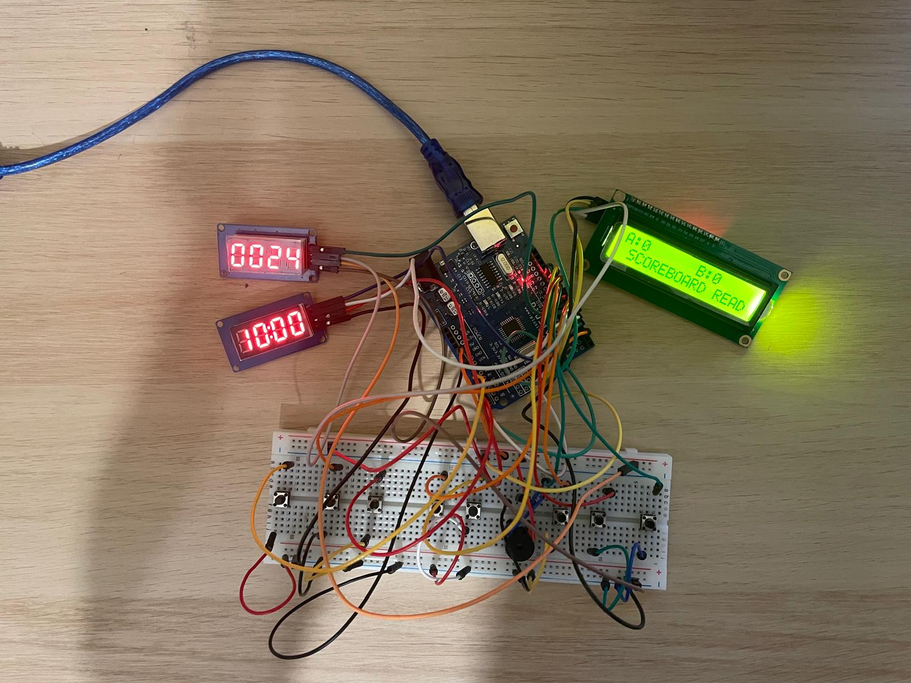

# Arduino Basketball Scoreboard

A basketball scoreboard I built with an Arduino. It has a game clock, a shot clock, score tracking for two teams, and a buzzer for when time runs out.

## Demo

 Here is a demo video of the basketball scoreboard:
 

## What it does

- Game clock counts down from 10 minutes
- Shot clock counts down from 24 or 14 seconds
- Two score counters (Team A and Team B)
- Buzzer sounds automatically when the game clock or shot clock hits zero
- Manual buzzer button for referee use
- Correction button to subtract a point by mistake
- Scores and game clock shown on an LCD and two 7-segment displays

## Parts used

| Part | Notes |
|---|---|
| Arduino Uno | Main board |
| TM1637 display | Game clock |
| TM1637 display | Shot clock |
| LCD 16x2 with I2C backpack | Shows scores |
| Buzzer | For end of clock signals |
| 7 push buttons | Controls listed below |

## Wiring

| Pin | Connected to |
|---|---|
| 4 | Game clock CLK |
| 5 | Game clock DIO |
| 6 | Shot clock CLK |
| 7 | Shot clock DIO |
| 13 | Buzzer |
| 8 | Team A score button |
| 9 | Team B score button |
| 10 | Correction button |
| 11 | Set shot clock to 24 |
| 12 | Set shot clock to 14 |
| A0 | Manual buzzer button |
| A1 | Shot clock start/stop button |
| 2 | Game clock start/stop button (interrupt pin) |

LCD uses I2C, so it just needs SDA and SCL wired to the Arduino's I2C pins, address 0x27.

All buttons use the Arduino's internal pull-up resistors, so wire them between the pin and ground, nothing else needed.

## How the buttons work

- **Game clock button**: press once to start/pause. When the clock reaches 0, the next press resets it back to 10:00 (still paused), and you press again to start it running.
- **Team A / Team B buttons**: add a point. Hold the correction button and press a team button to remove a point instead.
- **24 / 14 buttons**: set the shot clock to that number of seconds.
- **Shot clock start/stop button**: starts or pauses the shot clock.
- **Manual buzzer button**: sounds the buzzer for as long as it's held down.

## How the game clock reset works

When the game clock hits 0:00, it stops on its own and the buzzer sounds. At that point the button does something different depending on how many times you press it:

- **First press after hitting zero**: just resets the clock back to 10:00. It does not start counting down yet.
- **Second press**: now it starts counting down.

This is done on purpose, because 10:00 needs to be shown on the display before each quarter starts. If both things happened on the same button press, the clock would start counting down the instant you reset it.

## Known issues

- The game-over buzzer uses `delay()` for the beeping pattern, which briefly freezes button reads.
- Button debounce is handled with one shared timer for all buttons rather than one per button. Works fine for this use case, because the buttons don't need to be pressed very fast one after the other.

## Possible improvements

- Replace the blocking delay() in the buzzer pattern with a non-blocking timer
- Add a settable game clock length instead of a fixed 10 minutes for other sports, add number of fouls on the scoreboard

## License

MIT
